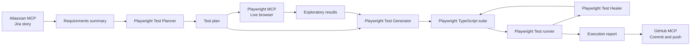

# AI E2E Testing Framework

A requirements-driven end-to-end QA framework built with Playwright Test, MCP-powered browser exploration, Jira requirement retrieval, specialist planning/generation/healing agents, and GitHub artifact delivery.

The current reference implementation validates the Flipkart product-search story `SCRUM-6`.

## What This Framework Does

1. Retrieves a Jira story and extracts testable requirements.
2. Produces a requirements summary and executable test plan.
3. Explores the live application through Playwright MCP.
4. Generates Playwright tests using discovered selectors.
5. Executes tests and records real failures.
6. Heals automation defects without weakening requirement assertions.
7. Produces exploratory, healing, and stakeholder execution reports.
8. Optionally commits the complete result to GitHub through GitHub MCP.

## Architecture



### Main Components

- **Requirements layer:** Atlassian MCP retrieves Jira stories, comments, attachments, and remote links.
- **Planning layer:** `playwright-test-planner` turns confirmed requirements into scenario-level test plans.
- **Exploration layer:** Playwright MCP inspects the live UI and records accessible names, navigation, screenshots, console output, and network observations.
- **Automation layer:** `playwright-test-generator` creates Playwright Test files, page objects, fixtures, and support utilities.
- **Execution layer:** Playwright Test runs browser projects and produces traces, screenshots, and HTML reports.
- **Healing layer:** `playwright-test-healer` repairs automation defects while preserving strict story assertions for real product defects.
- **Delivery layer:** GitHub MCP commits QA artifacts to the configured repository.

## MCP Servers and Agents

Configured MCP servers are listed in `.vscode/mcp.json`:

- `atlassian`: Jira and Confluence context through Atlassian MCP.
- `playwright`: Browser exploration and live application inspection.
- `playwright-test`: Playwright Test planning, generation, execution, and healing workflows.
- `github`: Repository inspection and artifact commits.

Specialist agents used by the workflow:

- `playwright-test-planner`
- `playwright-test-generator`
- `playwright-test-healer`

## Project Layout

```text
.
├── .github/.prompts/qa-orchestrator-workflow.md  # Phase-by-phase QA workflow
├── .vscode/mcp.json                             # MCP server configuration
├── specs/                                        # Requirements and test plans
├── tests/search/                                 # Search feature automation
│   └── support/                                  # Page objects and fixtures
├── test-results/                                 # Healing and execution reports
├── playwright.config.ts                         # Browser projects and APP_URL
└── package.json                                 # Commands and dependencies
```

## Setup

```bash
npm install
npx playwright install
```

Run the search suite against Flipkart:

```bash
npm run test:search -- --project=chromium
```

Run all configured browser projects:

```bash
npm run test:search
```

Open the HTML report:

```bash
npm run report
```

## Website Configuration

The application URL is configurable through `APP_URL`. Flipkart is the default:

```bash
APP_URL=https://www.flipkart.com npm run test:search -- --project=chromium
```

Use another website without editing test code:

```bash
APP_URL=https://staging.example.com npm run test:search -- --project=chromium
```

The shared `SearchPage` uses `page.goto('/')`, so the configured base URL controls the target. For sites with different workflows or accessible names, create a site-specific page object under that feature's `support/` directory.

Keep credentials in environment variables or CI secret storage. Never commit passwords, OTPs, API keys, session tokens, or customer data.

## Test Case Conventions

- Map each test to a Jira acceptance criterion or business rule.
- Include the requirement ID in the test title.
- Use only story-defined or plan-defined test data.
- Start from an isolated browser state.
- Prefer `getByRole`, `getByLabel`, and `getByText` locators.
- Assert observable user behavior rather than implementation details.
- Keep expected product defects as strict failing assertions.
- Skip only when required fixtures, credentials, service controls, or infrastructure are unavailable.
- Avoid arbitrary sleeps; use condition-based Playwright assertions.

## Page Objects and Fixtures

Page objects own selectors and user actions. Tests own business assertions. Fixtures in `tests/search/support/fixtures.ts` expose reusable page objects. Add reusable components for search, filters, sorting, login, navigation, and product cards.

## QA Workflow

The complete workflow is defined in `.github/.prompts/qa-orchestrator-workflow.md`:

1. Retrieve requirements with Atlassian MCP.
2. Save `specs/requirements-summary.md`.
3. Delegate planning to `playwright-test-planner` and save `specs/test-plan.md`.
4. Explore the live application with Playwright MCP.
5. Delegate automation to `playwright-test-generator`.
6. Execute and heal with Playwright Test and `playwright-test-healer`.
7. Save `test-results/healing-report.md` and `test-results/test-execution-report.md`.
8. Commit artifacts with GitHub MCP when a repository URL is supplied.

## Current SCRUM-6 Status

The current Flipkart search run recorded 5 automated passes, 3 open live application/catalog discrepancies, and 5 intentionally skipped infrastructure-dependent scenarios. The live site did not match the story's exact empty-search and no-results messages, and case/whitespace normalization was inconsistent in the final full-suite run.

## Adding New Websites and Test Cases

1. Retrieve confirmed requirements.
2. Create a requirements summary and scenario-level plan.
3. Explore the target website with Playwright MCP.
4. Record accessible selectors and observed states.
5. Add a site/feature page object and fixture.
6. Add independent tests grouped by test area.
7. Run the narrow suite, then regression.
8. Heal automation defects without changing product requirements.
9. Update reports and commit artifacts.

## Limitations

Public websites can change selectors, catalog results, prices, and availability without notice. Service failure, database, authorization, availability, and load tests require dedicated QA infrastructure. Exact result counts should not be hardcoded when the requirement provides only an example.
